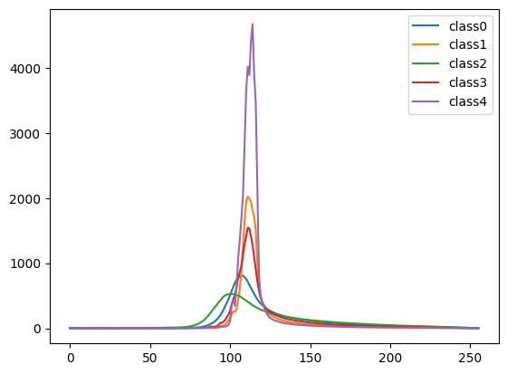
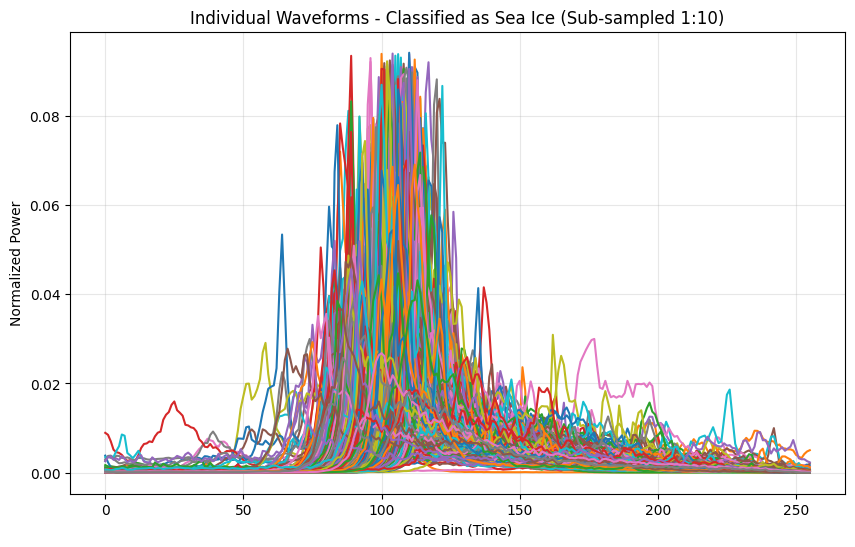
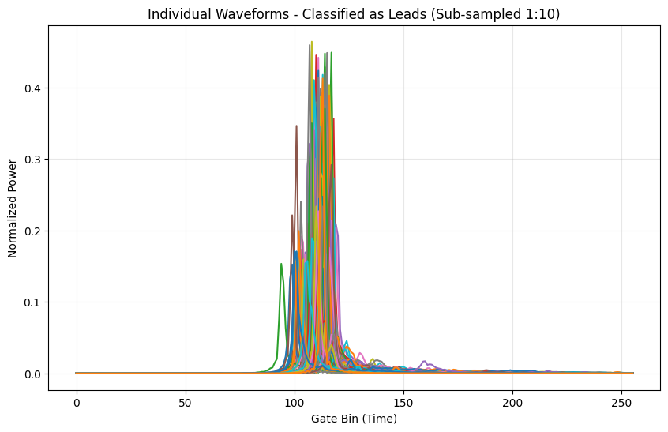
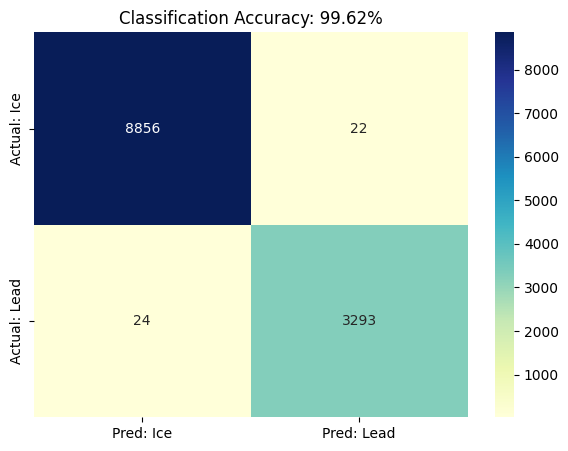

# GEOL0069_Assignments
# Surface Type Discrimination of Arctic Sea Ice and Leads using Sentinel-3 SAR Altimetry and Unsupervised Clustering

**Author**: Gareth Jiang  
**Student ID**: 23004877  
**Module**: GEOL0069 | Artificial Intelligence for Earth Observation  

---

## 1. Context and Research Rationale
Accurate discrimination between sea ice and leads (open water fractures) is a prerequisite for reliable sea ice freeboard retrieval and thickness estimation. The physical interaction of Ku-band radar pulses with the Arctic surface varies significantly depending on the target's dielectric properties and roughness. This analysis implements an unsupervised classification framework to categorize these surface types by analyzing the morphological characteristics of Sentinel-3 SAR waveforms.

## 2. Classification Framework
The methodology relies on the extraction of waveform-derived parameters that serve as proxies for surface roughness and reflectivity.

### 2.1 Feature Selection and Physical Basis
The classification utilizes a triplet of parameters extracted from the radar echoes:
* **Sigma0 ($\sigma^0$)**: Quantifies backscatter intensity. Leads typically exhibit high magnitude returns due to the specular nature of calm open water.
* **Peakiness (PP)**: Defined as the ratio of the maximum power to the mean power of the waveform. It identifies the "sharpness" of the echo; specular reflections from leads yield significantly higher PP values compared to the diffuse scattering from sea ice.
* **Stack Standard Deviation (SSD)**: Derived from the Doppler stack, this parameter measures the variation in backscatter as a function of the look angle, providing further distinction in surface scattering mechanisms.

### 2.2 Stochastic Modeling via Gaussian Mixture Models (GMM)
Rather than employing rigid centroid-based clustering, a **Gaussian Mixture Model (GMM)** was selected to accommodate the multimodal distribution of the feature space. By modeling the data as a mixture of multiple Gaussian distributions, GMM accounts for the covariance structure of the feature set, allowing for a more nuanced probabilistic separation between classes.

*Figure 1: Initial classification results showing clustered mean waveforms for different surface classes.*

## 3. Empirical Evaluation and Waveform Analysis

### 3.1 Waveform Morphology and Physical Validation
Analysis of the clustered mean waveforms confirms a clear divergence in backscatter morphology. The class associated with **Leads** displays a sharp, specular peak with rapid power decay, consistent with mirror-like reflection. Conversely, the **Sea Ice** class exhibits a broader, diffuse return, characteristic of surface scattering from rougher ice floes.

*Figure 2: Physical signature comparison between Lead (specular) and Sea Ice (diffuse) echoes.*

### 3.2 Signal Stability Across Sub-samples
Visual inspection of individual normalized waveforms (Figures 3 & 4) confirms the GMM's robustness. Despite geographical variability across the Arctic transect, the returns within each cluster maintain a high degree of morphological consistency. This clustering stability indicates that the selected feature triplet of Sigma0, PP, and SSD effectively serves as a reliable proxy for surface discrimination, maintaining high signal-to-noise fidelity.

*Figure 3 & 4: Sub-sampled normalized individual waveforms for Sea Ice and Leads, demonstrating classification consistency.*

### 3.3 Quantitative Assessment
The unsupervised classification results were benchmarked against official European Space Agency (ESA) surface type flags. The model achieved a high degree of fidelity with a validated accuracy of **99.62%**.

*Figure 5: Confusion matrix showing the final validation accuracy of 99.62%.*

## 4. Summary of Findings
The achieved validation accuracy of 99.62% (Figure 5) quantifies the efficacy of using peakiness and backscatter coefficients as primary morphological discriminators. Beyond classification, this automated workflow provides a robust foundation for adaptive waveform retracking, ultimately contributing to the refinement of sea ice thickness retrieval and large-scale cryospheric monitoring in the Arctic region.
